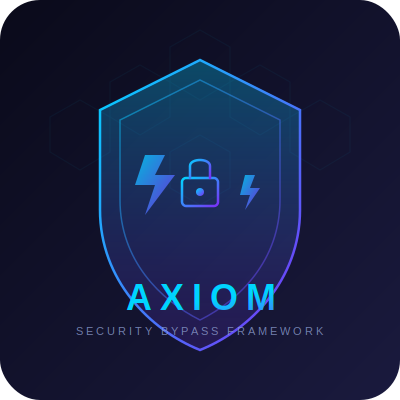

<p align="center">
  
</p>

<h1 align="center">Axiom</h1>
<p align="center">
  <b>Multi-Layer Security Bypass Framework</b><br>
  <i>Penetration testing toolkit for CDN, WAF, CAPTCHA, bot detection, and rate limit evaluation</i>
</p>

<p align="center">
  
  
  
</p>

---

Axiom is a comprehensive penetration testing framework for evaluating web application security controls. It systematically tests protections across multiple layers — CDN, WAF, CAPTCHA, bot detection, rate limiting, honeypots, and IP blocks — helping security professionals identify weaknesses in their defensive posture.

> **Designed for authorized security testing and educational purposes only.**

## Features

<pre>
┌─────────────────────────────────────────────────────────────────────────┐
│                                                                         │
│   🔍  Discovery                                                         │
│   ├──  CDN detection         — Cloudflare, CloudFront, Fastly, Akamai  │
│   ├──  WAF fingerprinting    — 10+ WAFs via headers, cookies, body     │
│   ├──  Origin IP hunting     — crt.sh, DNS history, subdomain enum     │
│   └──  Tech stack detection  — Server, language, framework, CMS        │
│                                                                         │
│   ⚡  Bypass                                                             │
│   ├──  WAF evasion           — SQLi, XSS, LFI, RCE, header injection   │
│   ├──  CAPTCHA testing       — OCR, audio STT, rate limit trigger      │
│   ├──  Rate limit bypass     — Header spoof, burst, slowloris patterns │
│   ├──  Bot detection test    — UA rotation, TLS fingerprint, referer   │
│   ├──  Honeypot detection    — Hidden fields, CSS traps, timing traps  │
│   └──  IP block bypass       — Proxy rotation, geo-spoof, Tor network  │
│                                                                         │
│   🛡️  Scan                                                              │
│   ├──  Port scanner          — 100+ common ports with service detection │
│   ├──  Directory busting     — 80+ common paths, recursive scanning    │
│   └──  Vulnerability check   — Headers, redirect, SQLi, XSS, SSRF     │
│                                                                         │
└─────────────────────────────────────────────────────────────────────────┘
</pre>

## Installation

```bash
git clone https://github.com/farhanturu/axiom.git
cd axiom

python3 -m venv .venv
source .venv/bin/activate   # Linux/macOS
# .venv\Scripts\activate    # Windows

pip install -r requirements.txt
```

Optional dependencies for advanced CAPTCHA OCR:

```bash
# Linux
sudo apt-get install tesseract-ocr

# macOS
brew install tesseract
```

## Quick Start

```bash
# Full assessment — discovery, scan, and bypass in one run
python3 main.py -t https://target.com --full

# Discover CDN, WAF, and origin IPs
python3 main.py -t https://target.com --discover --tech

# WAF bypass testing with SQLi/XSS/LFI/RCE payloads
python3 main.py -t https://target.com --bypass waf --param id

# CAPTCHA and rate limit testing
python3 main.py -t https://target.com --bypass captcha

# Bot detection evasion testing
python3 main.py -t https://target.com --bypass botdetect

# Full vulnerability scan
python3 main.py -t https://target.com --scan all

# Port scan only (quick mode)
python3 main.py -t https://target.com --scan ports --quick

# Directory brute force
python3 main.py -t https://target.com --scan dirs

# Save results to JSON
python3 main.py -t https://target.com --full -o results.json
```

## Usage

### Module: Discovery

Identify infrastructure components protecting the target.

| Command | Description |
|---------|-------------|
| `--discover` | Run full discovery (CDN, WAF, origin IP) |
| `--tech` | Detect technology stack (server, frameworks, CMS) |

**Output includes:**
- CDN provider (Cloudflare, CloudFront, Fastly, Akamai, Imperva, StackPath)
- WAF type with confidence score and indicators
- Origin IP candidates from multiple sources
- Technology stack with detected frameworks and analytics

### Module: Bypass

Evaluate the effectiveness of security controls.

| Command | Description |
|---------|-------------|
| `--bypass all` | Run all bypass techniques |
| `--bypass waf` | WAF evasion (SQLi, XSS, LFI, RCE payloads) |
| `--bypass captcha` | CAPTCHA detection and rate limit testing |
| `--bypass ratelimit` | Rate limit bypass patterns |
| `--bypass botdetect` | Bot detection evasion testing |
| `--param` | Parameter name for payload injection (default: `id`) |
| `--method` | HTTP method: `GET` or `POST` (default: `GET`) |

### Module: Scan

Discover exposed services and common vulnerabilities.

| Command | Description |
|---------|-------------|
| `--scan all` | Full scan (ports + directories + vulnerabilities) |
| `--scan ports` | Port scanning with service detection |
| `--scan dirs` | Directory and file enumeration |
| `--scan vulns` | Vulnerability checks |
| `--quick` | Fast port scan (top 30 ports) |

**Vulnerability checks include:**
- Missing security headers (HSTS, CSP, X-Frame-Options, etc.)
- Open redirect
- Directory listing
- Error-based SQL injection
- Reflected XSS
- SSRF

### Proxy Management

```bash
# Test proxy connectivity
python3 main.py --proxy-action check --proxies http://proxy1:8080 http://proxy2:8080

# Tor integration
python3 main.py --proxy-action tor --new-ip

# Custom Tor port
python3 main.py --proxy-action tor --tor-port 9150 --new-ip
```

### Options

| Flag | Description |
|------|-------------|
| `--target, -t` | Target URL or domain |
| `--output, -o` | Save results to JSON file |
| `--api-key, -k` | API key for SecurityTrails (enhances origin discovery) |
| `--verbose, -v` | Verbose output |
| `--quiet, -q` | Suppress output |
| `--timeout` | Request timeout in seconds (default: 10) |

## Architecture

```
axiom/
├── main.py                      CLI entry point
├── requirements.txt             Python dependencies
├── README.md                    Documentation
│
├── core/                        Core infrastructure
│   ├── client.py                HTTP client with TLS fingerprinting
│   ├── proxy.py                 Proxy rotation and Tor integration
│   ├── fingerprint.py           Browser fingerprint spoofing
│   ├── output.py                Rich console output
│   └── utils.py                 Shared utilities
│
├── modules/
│   ├── discovery/               Target reconnaissance
│   │   ├── cdn_finder.py        CDN and WAF detection
│   │   ├── origin_ip.py         Origin IP discovery
│   │   └── tech_stack.py        Technology stack detection
│   │
│   ├── bypass/                  Security control evasion
│   │   ├── waf.py               WAF bypass payloads
│   │   ├── captcha.py           CAPTCHA solving and testing
│   │   ├── ratelimit.py         Rate limit bypass patterns
│   │   ├── botdetect.py         Bot detection evasion
│   │   ├── honeypot.py          Honeypot detection
│   │   └── ipblock.py           IP block bypass
│   │
│   └── scan/                    Vulnerability scanning
│       ├── port.py              Port scanner
│       ├── dirbuster.py         Directory enumeration
│       └── vuln.py              Vulnerability detection
│
└── data/                        Reference data
    ├── user_agents.json         Browser user agent strings
    ├── waf_signatures.json      WAF detection signatures
    ├── cdn_ips.json             CDN IP ranges
    └── bypass_payloads.json     Attack payloads
```

## Data Reference

### Supported CDNs

Cloudflare, Amazon CloudFront, Fastly, Akamai, Imperva Incapsula, StackPath

### Supported WAFs

Cloudflare WAF, AWS WAF, Imperva Incapsula, Akamai Kona, F5 BIG-IP ASM, ModSecurity, Sucuri CloudProxy, Barracuda WAF, Fortinet FortiWeb, StackPath

### Payload Categories

- **SQLi**: Simple, encoded, case-obfuscated, time-based
- **XSS**: Simple, encoded, filter-bypass, polyglot
- **LFI**: Simple, encoded, null-byte, path normalization
- **RCE**: Command injection, encoded, blind
- **Header Injection**: CRLF, host spoof, IP spoof
- **Rate Limit Bypass**: X-Forwarded-For, X-Real-IP, Client-IP

## Ethical Use

Axiom is designed for:

- Authorized penetration testing engagements
- Internal security assessments
- CTF (Capture The Flag) competitions
- Security research and education
- Defensive security testing

**Do not use Axiom against systems you do not own or have explicit written authorization to test.** Unauthorized testing may violate computer fraud laws.

## License

MIT License. See [LICENSE](LICENSE) for details.

## Disclaimer

This software is provided for educational and authorized security testing purposes only. The authors are not responsible for any misuse or damage caused by this tool. Users are responsible for complying with all applicable laws and regulations in their jurisdiction.

---

<p align="center">
  <sub>Built for the security community · Contribute · Report issues · Fork · Share</sub>
</p>
